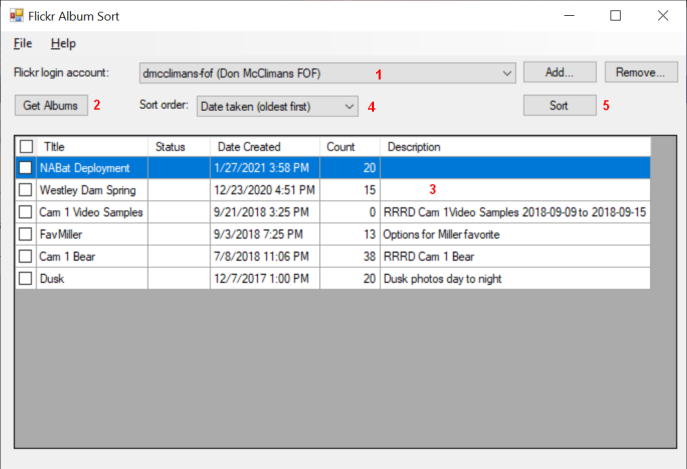
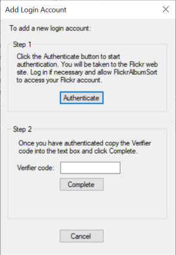

[FlickrAlbumSort](https://github.com/dmcclimans/FlickrAlbumSort)
==========

FlickrAlbumSort is a Windows application to sort the photos within your Flickr albums.

Flickr allows you to sort the photos in your albums by going to the Flickr Organizr and
selecting "Arrange". Unfortunately this does not set a persistent sort order for the
album. Things done in the Organizr are always one-off operations. If you add additional
photos to the album they are always added to the end.

FlickrAlbumSort helps you deal with this by providing a simple and convenient way to sort
multiple albums with just a few mouse clicks. You still have sort your albums every time
you add photos, but the operation is simple and quick.

## Contents
* [Features](#features)
* [Requirements](#requirements)
* [Installation](#installation)
* [Usage](#usage)
* [Authentication](#authentication)
* [Known Issues](#KnownIssues)
* [License](#license)

## Features
* Sort the photos within one or more albums of your Flickr account.
* The sort order can be based on:
    * Date Taken
    * Date Uploaded
    * Title

## Requirements
* Requires Windows 10 or later.

## Installation
* Go to the FlickrAlbumSort
  [latest release](https://github.com/dmcclimans/FlickrAlbumSort/releases/latest)
  page and download `FlickrAlbumSort_x.y.zip` (where x.y is the version number).

* Unzip the files into a folder, and run `FlickrAlbumSort.exe`.

## Usage

1. The **Login account** is the Flickr account that will processed. Click the Add button
to add a new account. See [Authentication](#authentication), below.

2. Click the **Get Albums** button to retrieve the list of albums for the login account.

3. The **Album list** shows the albums retrieved by the **Get Albums** button. Select the
albums that you wish to sort. You can click on the column headers to sort the albums by
Title or other property. Click on the checkbox at the very top to select or unselect all
albums.

4. Select the **Sort order**.

    * Date taken (oldest first)
    * Date taken (newest first)
    * Date uploaded (oldest first)
    * Date uploaded (newest first)
    * Title (A-Z)
    * Title (Z-A)

5. Click the **Sort** button to perform the sort.

## Authentication

To add a **Login account**, you must "Authenticate" the FlickrAlbumSort application with
that account. This process tells Flickr to allow FlickrAlbumSort to access and modify the
account. You must be logged in to the account to be able to authenticate.

FlickrAlbumSort requires **write** access to your account because changes the sort order.
It does not modify your photos in any way, it only changes the order of the images within
your album.

To authenticate:

1. In your browser, log into the Flickr account that you wish to add.

2. In FlickrAlbumSort, click the **Add** button to add a login account.

3. You will see the Add Login Account dialog:

4. Click the Authenticate button.

5. Your browser will open a new window or tab displaying a Flick Page asking you to
authorize FlickrAlbumSort to access your account.

    Click **OK, I'll authorize it**.

6. Flickr will display another web page showing the 9-digit authorization code. Copy and
paste this code into the **Verifier code** text box in FlickrAlbumSort.

7. Click the **Complete** button.

8. Close the Add Login Account dialog.

## Known Issues

**Flickr time-out errors**

You may experience time-out or other communication errors when the program is
transferring data to and from Flickr. The program will attempt to recover from
these errors by retrying the commands, but this is not always successful. After 3
failed attempts the program will display an error message and stop communicating.

If you wish you can repeat the sort to see if Flickr will process the commands.

## License
FlickrAlbumSort is licensed under the MIT license. You may use the FlickrAlbumSort
application in any way you like. You may copy, distribute and modify the FlickrAlbumSort
software provided you include the copyright notice and license in all copies of the
software.

FlickrAlbumSort links to a library that is licensed under the Apache 2.0 License.

See the [License.txt](License.txt) file for additional information.

